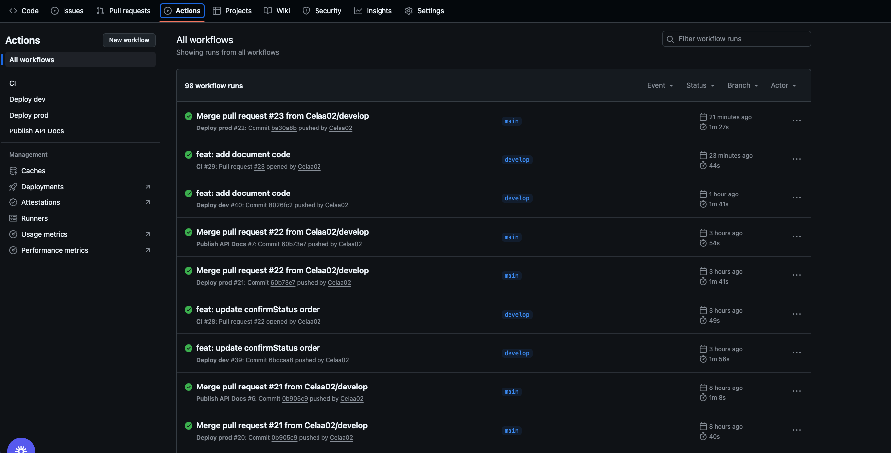

# 🛒 Orders & Products API - Backend Serverless (Node.js + AWS)

This service manages the core API logic:

- **Products** management (create, update, delete, list).
- **Orders** management(create, get by ID, list by user, confirm).
- Centralized handling of **validations, logs, and errors**.
- Architecture based on **Clean Architecture** for better maintainability.

Deployed on **AWS Lambda** using **Serverless Framework**.

---

## 🚀 Technologies Used

- [Node.js + TypeScript](https://nodejs.org/) - Main language
- [AWS Lambda](https://aws.amazon.com/lambda/) - Serverless execution
- [AWS API Gateway](https://aws.amazon.com/api-gateway/) - API entry point
- [DynamoDB](https://aws.amazon.com/dynamodb/) - NoSQL database
- [Serverless Framework](https://www.serverless.com/) - Infrastructure as Code
- [Swagger / OpenAPI](https://swagger.io/specification/) - API Documentation
- [GitHub](https://github.com/) - Project hosting platform

---

## 📦 Installation

1. Clone the repository:

```bash
git clone https://github.com/Celaa02/alegra-kitchen
cd alegra_kitchen
```

2. Install dependencies:

   ```bash
   npm install
   ```

3. Create a `.env` file at the root:

```env
  STAGE=dev
  IS_OFFLINE=true
  LOG_LEVEL=debug

  ORDERS_TABLE_NAME=OrdersTable
  PRODUCTS_TABLE_NAME=ProductsTable
  AWS_REGION=us-east-1
```

4. Run the server.

```npm run dev

```

---

## 🧪 Available Scripts

```bash
# Start local environment with serverless-offline
unset AWS_PROFILE AWS_SESSION_TOKEN
export AWS_ACCESS_KEY_ID=local
export AWS_SECRET_ACCESS_KEY=local
export AWS_REGION=us-east-1
export FORCE_LOCAL=true
export DYNAMO_ENDPOINT=http://127.0.0.1:8000

npx serverless offline --stage dev

# Run unit tests with Jest
npm run test

# Generate coverage report
npm run test:coverage
```

---

## 🌐 AWS Deployment

```bash
# Deploy to AWS (dev stage)
npx serverless deploy --stage dev --region $AWS_REGION

# Deploy to AWS (prod stage)
npx serverless deploy --stage prod --region $AWS_REGION
```

---

## 🧾 Main Endpoints

| Method | Path                        | Description                           |
| ------ | --------------------------- | ------------------------------------- |
| POST   | `/products`                 | Create product                        |
| GET    | `/products`                 | List products                         |
| GET    | `/products/{productId}`     | Get product by ID                     |
| PUT    | `/products/{productId}`     | Update product by ID                  |
| DELETE | `/products/{productId}`     | Delete product by ID                  |
| POST   | `/orders`                   | Create order                          |
| GET    | `/orders/{id}`              | Get order by ID                       |
| GET    | `/users/{userId}/orders`    | List orders for a user                |
| PATCH  | `/orders/{orderId}/confirm` | Confirm an order (status → CONFIRMED) |

---

---

## 📑 Available Documentation

- [Swagger UI - docs](https://celaa02.github.io/service-api/#/) - (public/openapi.yaml) Documentation / Orders & Products API

---

## 🔗 Deployment

**Production base URL**:

- [Orders & Products APIp](https://50tebmulz5.execute-api.us-east-1.amazonaws.com/prod/orders/) - Service URL

**Development base URL**:

- [Orders & Products API](https://vl3dwdespl.execute-api.us-east-1.amazonaws.com/dev/orders/) - Service URL

---

## 🧠 Notes

- The project follows Clean Architecture:
  -- Domain: contracts and models
  -- Use Cases: business logic
  -- Infrastructure: DynamoDB repositories
  -- Adapters/Handlers: API Gateway integration
- Centralized errors with AppError and toHttpResponse.
- Logs handled with Winston.
- Input validated with Joi before business logic execution.

---

## 🚀 CI/CD with GitHub Actions

This project uses **GitHub Actions** to automate:

- **CI (Continuous Integration)**:
  - Install dependencies
  - Run unit tests
  - Validate coverage

- **CD (Continuous Deployment)**:
  - Automatic deployment to AWS Lambda on every merge to main.

### Main workflows:

- `.github/workflows/develop-dev.yml` → runs on PRs into `develop`
- `.github/workflows/develop-prod.yml` → runs on merges into `main`

## 📸 GitHub Actions Workflows



---

Made with ❤️ by [Celaa02](https://github.com/Celaa02/service-api)
